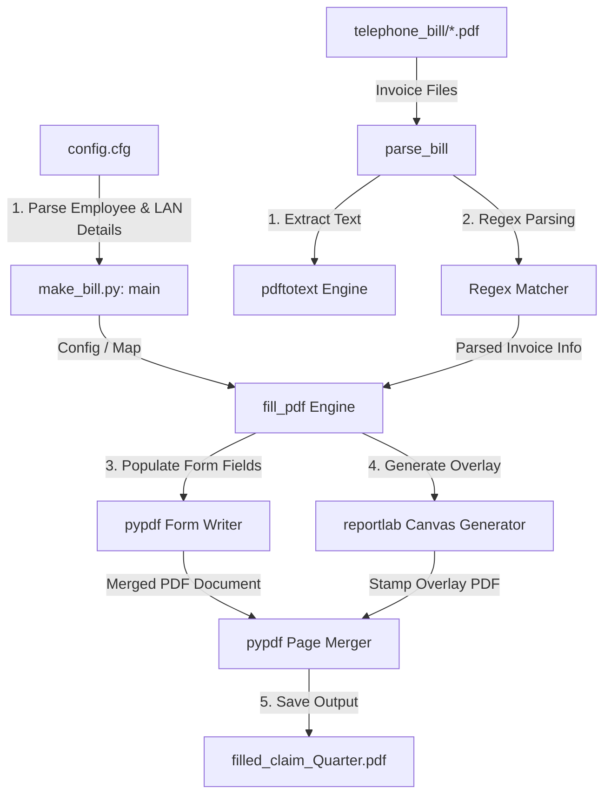
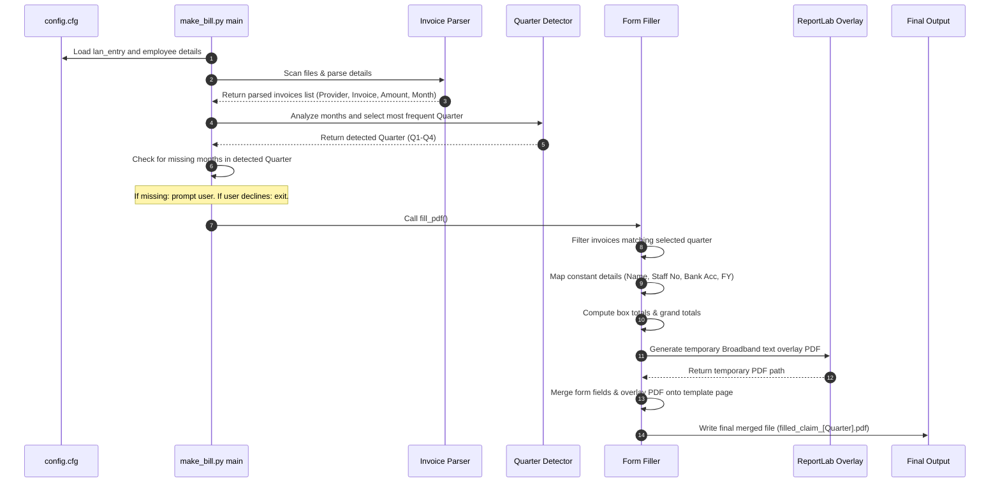

# Architecture Design & Workflow: Telephone Bill Maker

This document details the software architecture, data mapping rules, and design workflow for the C-DOT Telephone Bill Maker tool.

---

## 1. System Overview

The tool is a utility designed to automate the process of parsing digital telephone invoices and populating a standard C-DOT reimbursement PDF template (`template.pdf`).

---

## 2. Component Architecture

The tool is built with a modular pipeline structure in [make_bill.py](file:///home/bikash/workera/personal_git/telephone-bill-maker/make_bill.py):

### Components Description:
1. **Configuration Reader**: Reads employee and connection credentials (such as Name, Staff No, LAN Entry No, Account No, etc.) from `config.cfg` dynamically using python's standard `configparser` module.
   
   > [!NOTE]
   > Whitespace characters before or after the `=` sign do not matter. The `configparser` parser automatically trims leading/trailing spaces for both keys and values, and the script applies `.strip()` to clean all values.

2. **CLI / Input Manager**: Automatically passes variables directly to the filler, requiring zero user-interaction unless a validation warning occurs.
3. **Text Extraction Engine**: Scans the `telephone_bill` directory, caches extracted text to `.txt` files to avoid redundant operations, and runs `pdftotext` on PDFs.
4. **Regex Parsing Engine**: Analyzes invoice text using regular expressions to extract:
   - Bill type classification (Postpaid Mobile vs. Broadband) based on invoice code prefix (HF vs MF) and header text keywords.
   - Invoice numbers (identifies labels like `Invoice No` or fallback Airtel patterns).
   - Total payable amounts matching amount labels or decimal number patterns (independent of any hardcoded plan thresholds).
   - Billing month periods.
5. **Automated Quarter Detection**: Inspects the parsed billing months from all files, groups them, and determines the target billing quarter (Q1-Q4) automatically based on the most frequent quarter.
6. **Missing Month Safeguard**: Cross-references the detected quarter's months with the present bills. If any month is completely missing, prompts the user to proceed (blanking the month) or exit immediately.
7. **Form Filling Engine**: Populates target fields (such as employee details, dates, banking, and totals) in the PDF using `pypdf`.
8. **Overlay Stamp Generator**: Generates a temporary PDF containing custom text (e.g. `"Broadband"`) at precise coordinate positions (X, Y) using `reportlab`, then merges it as a page stamp.

---

## 3. Detailed Data Flow

The sequential operations of the pipeline are structured as follows:

---

## 4. PDF Form Field Mappings

The table below lists the interactive PDF form fields mapped by the tool:

| Field Name | Type | Section / Key in CFG | Description / Mapping Logic |
| :--- | :--- | :--- | :--- |
| **LAN Entry** | Text | `[EmployeeDetails] lan_entry` | User's LAN Entry No. |
| **Name** | Text | `[EmployeeDetails] name` | BIKASH ROUT |
| **Staff No** | Text | `[EmployeeDetails] staff_no` | 6171 |
| **Date** | Text | Today's Date | Formatted as `DD-MM-YYYY` |
| **Group** | Text | `[EmployeeDetails] group_name` | SRSW |
| **Group Code** | Text | `[EmployeeDetails] group_code` | 3YA |
| **Product** | Text | `[EmployeeDetails] product_name` | 5G NON SA |
| **Product code** | Text | `[EmployeeDetails] product_code` | G06 |
| **A/C** | Text | `[EmployeeDetails] bank_account_no` | Bank Account No. |
| **Fin Year** | Text | Current Year | Dynamic current year |
| **Name_1** | Text | `[EmployeeDetails] name` | Signature area name |
| **Staff No_1** | Text | `[EmployeeDetails] staff_no` | Signature area staff number |
| **Text Field** | Text | Today's Date | Bottom-left signature date |
| **Check Box_21** | Checkbox | `LEVEL_13A_10_CHECKBOX` | Checked `/Yes` (Level 13A to 10) |
| **Check Box_20** | Checkbox | Q4 Selector | Checked `/Yes` if Q4 detected |

> [!IMPORTANT]
> **Box 3 (Broadband) Row Configuration**: 
To conform to the specific filing instructions, the Broadband (Box 3) table writes values only in **Row 1**, **Row 3**, and **Row 5** (mapping to fields `_6`, `_8`, and `_10` respectively). Rows 2, 4, and 6 remain completely empty.

---

## 5. Tailored Font Sizes & Appearance Stream Handling

To ensure maximum visual quality and prevent text clipping on narrow fields:

1. **Tailored Font Sizes**:
   - For all metadata fields (`LAN Entry`, `Name`/`Name_1`, `Staff No`/`Staff No_1`, `Date`, `Group`/`Group Code`, `Product`/`Product code`, `A/C`, `Fin Year`) and `Amount` / `Total` fields, the font size is increased to **10.0pt** for enhanced readability.
   - For the bottom-left signature Date field (`Text Field`) (which is very narrow), the font size is set to **7.5pt** to avoid text clipping and overlap.
   - For all `Invoice No` fields (which contain long 16-character numbers), the font size is set to **7.5pt** to fit the text box width perfectly.
   - Other fields (such as `Service Provider`) are kept at their original template default (auto-scaled) sizes for optimal visual layout.
2. **Forced Rendering (`/NeedAppearances`)**:
   - The tool sets `/NeedAppearances` to `False` in the PDF `AcroForm` catalog.
   - For the resized fields (Metadata, Amounts, Signature Date, and Invoice Numbers) only, it updates `/DA` and deletes the pre-baked appearance dictionary (`/AP`), forcing the PDF viewer to regenerate the text dynamically. Other fields (like `Service Provider`) are left untouched, preserving their original pre-baked appearances.

---

## 6. Execution Warning Reporting

To guarantee data transparency and alert the user to any parsing failures:
- During parsing, if any value (Provider Name, Invoice No, Amount, or Month) is not successfully detected in a bill file, the tool logs a clear warning message to the console showing which fields were missed.
- Missing values are filled as empty strings (`""`) on the PDF form, ensuring the script completes successfully and outputs a valid document without crashing.

---

## 7. Visual Coordinates for Label Overlay

Since the template PDF lacks a form field next to the Broadband label, the tool uses reportlab to draw it directly on the canvas:

- **Label text**: `"Broadband"` (bold, size 12)
- **Coordinates**: `X = 460`, `Y = 428` (placed on the rightmost side slightly above the horizontal line)
