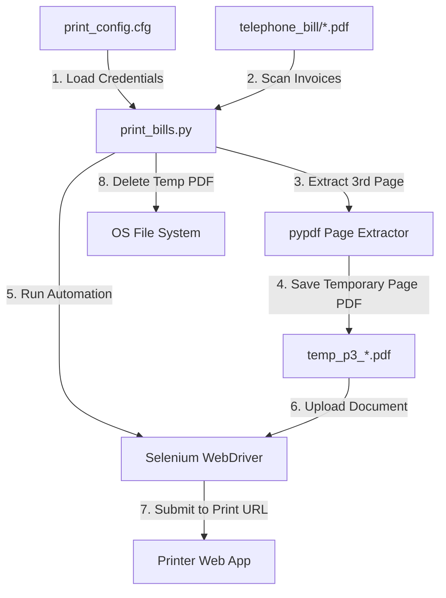
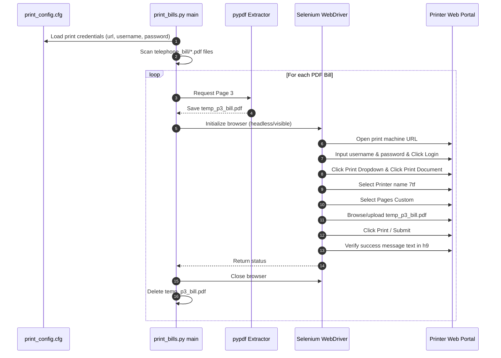

# Architecture Design: Selenium Print Automation Tool

This document outlines the software design, system components, sequence flow, and file mapping rules for the print automation tool.

---

## 1. Component Architecture

The print tool operates as a batch execution pipeline:

### Components Description:
1. **Configuration Reader**: Reads printer web app credentials (URL, username, password) from `print_config.cfg` using python's standard `configparser` module.
2. **Batch Scanner**: Lists all `.pdf` files inside the `telephone_bill/` folder, skipping templates and output filled claim PDFs.
3. **PDF Extractor**: Extracts only the 3rd page (index 2) of a target bill and saves it temporarily to the disk.
4. **Selenium Driver Manager**: Instantiates Chrome driver using `webdriver.Chrome()`, automatically handling headless mode if no GUI display server is found.
5. **Selenium Automation Flow**: Walks through login, dropdown selection, printer select, page selection, file upload, form submission, and verification steps.
6. **Cleanup Subsystem**: Deletes the temporary page PDF files after each iteration to ensure clean workspace state.

---

## 2. Sequence Flow

The printing submission sequence operations are structured as follows:

---

## 3. Selenium Target Element Selectors

The table below lists the XPath and ID element selectors used by Selenium:

| Step Description | Selector Type | Value |
| :--- | :--- | :--- |
| **Username Input** | XPath | `//*[@id="username"]` |
| **Password Input** | XPath | `//*[@id="password"]` |
| **Login Button** | XPath | `/html/body/section/div/div/div/div/div/div[2]/div/form/div[5]/button` |
| **Print Dropdown** | XPath | `//*[@id="dropdownUsers"]` |
| **Print Document Link** | XPath | `/html/body/div/header/div/div[1]/ul/li[2]/ul/li[1]/a` |
| **Printer Name 7tf Option** | XPath | `/html/body/div[2]/main/div[2]/div[3]/form/div/div[2]/div[1]/div[2]/select/option[5]` |
| **Pages Custom Option** | XPath | `/html/body/div[2]/main/div[2]/div[3]/form/div/div[2]/div[2]/div[2]/select/option[2]` |
| **File Upload Input** | ID | `fileupload` |
| **Submit Button** | XPath | `//*[@id="submit"]` |
| **Success Verification Text** | XPath | `/html/body/div/main/div[2]/center/h9` |
